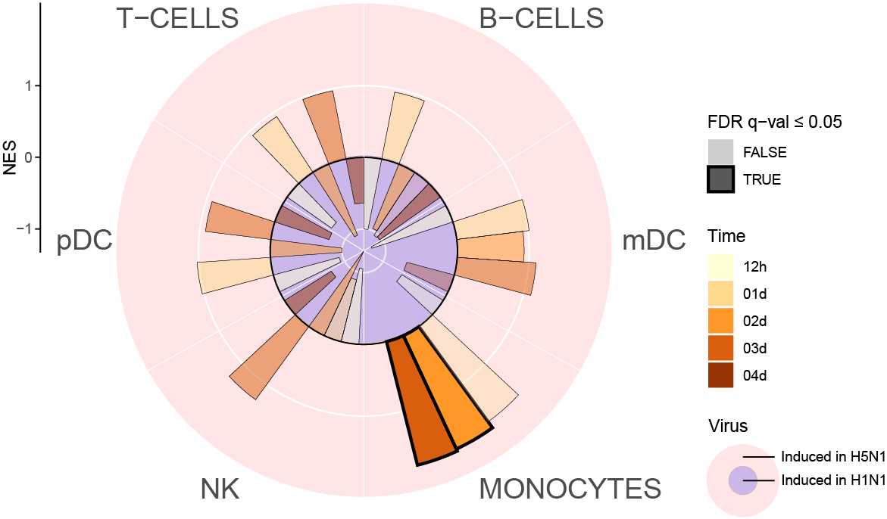
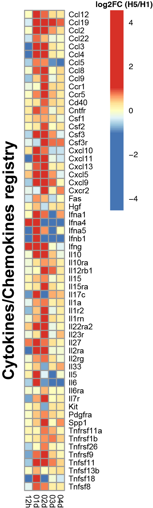
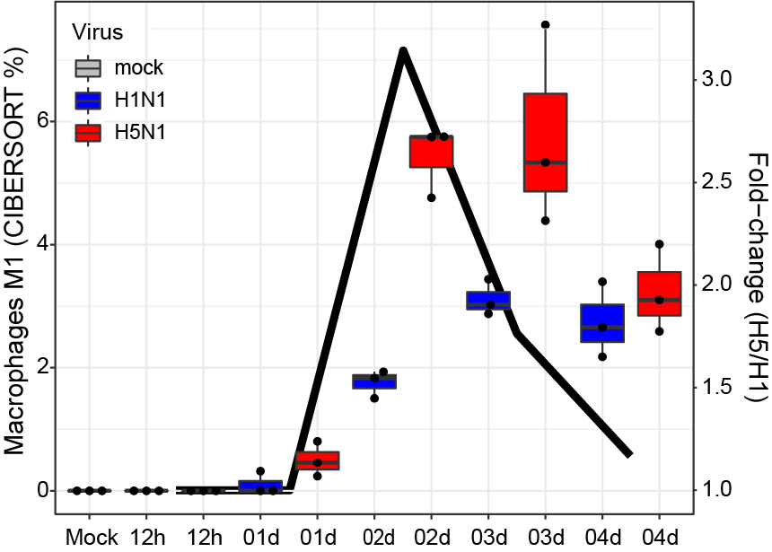

# FluOMICS lung: source code #

## List of figures:
[Fig. 1A](#fig-1a), [Fig. 1D](#fig-1d), [Fig. 2A](#fig-2a)  

### Fig. 1A

Fig. 1A: [R code [MD]](code/20190408_Fluomics.fig1a.md), [Input file [RDA]](output/fluomics.gseaOutput.RData)  

### Fig. 1D
  
Fig. 1D: [R code [MD]](code/20190408_Fluomics.fig1d.md), [Input files [RDA]](output/fluomics.gseaOutput.RData)  

### Fig. 2A
  
Fig. 2A: [R code [MD]](code/20190412_Fluomics.fig2a.md), [Input files [RDA]](output/fluomics.seqSetRaw.RData)  

## Supplemental material:

### a. RNA-Seq analysis:
code:  
- preprocessing: [[MD]](code/20190402_Fluomics.preprocessing.md)  
- geneset-analysis: [[MD]](code/20190408_Fluomics.geneset_analysis.md)  
  
input:  
- non-normalized (raw) gene counts: [[CSV]](input/lung.genecounts.csv)  
- mouse GRCm38 genome annotation: [[GTF]](input/genes.gtf)  
- sample annotation: [[TSV]](input/SraRunTable.txt)  
  
output:  
- raw SeqExpressionSet: [[RDA]](output/fluomics.seqSetRaw.RData)  
- normalized SeqExpressionSet: [[RDA]](output/fluomics.seqSet.RData)  
- mock-subtracted SeqExpressionSet: [[RDA]](output/fluomics.seqSetBaselined.RData)  
- DGEGLM list: [[RDA]](output/fluomics.fits.RData)  
- gsea results table: [[RDA]](output/fluomics.gseaOutput.RData)  
  
### b. Genesets differentiating between Mo-derived and tissue-residents macrophages:
code:  
- gmt creation: [[MD]](code/20190415_Fluomics.mdm_vs_trm.md)  
  
output:  
- macrophage origin gmt: [[TSV]](utils/Macrophage.gmt)
