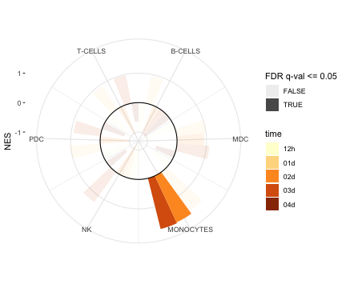

Load required packages

```r
suppressPackageStartupMessages(library(package = "knitr"))
suppressPackageStartupMessages(library(package = "tidyverse"))
```

Define session options

```r
workDir <- dirname(getwd())
opts_chunk$set(tidy = FALSE, fig.path = "../figure/")
options(stringsAsFactors = FALSE)
```

Load GSEA output

```r
load(file = file.path(workDir, "output/fluomics.gseaOutput.RData"))
```

Plot radial plot

```r
plotDF <- filter(gseaOutput, modelName %in% "virus" &
			       (!grepl(pattern = "-", NAME) |
				  NAME %in% c("B-CELLS", "T-CELLS"))) %>%
  select(NAME, NES, `FDR q-val`, coefName) %>%
  mutate(time = gsub(pattern = ".+\\.([^\\.]+)$",
			    replacement = "\\1",
		     coefName),
	 time = factor(time),
	 time = relevel(time, ref = "12h"),
	 NAME = factor(NAME),
	 NAME.num = as.numeric(NAME))

ggplot(data = plotDF,
       mapping = aes(x = NAME.num, y = NES)) +
  geom_bar(stat = "identity",
	   position = "dodge",
	   mapping = aes(fill = time,
			 alpha = (`FDR q-val` <= 0.05))) +
  geom_hline(yintercept = 0) +
  scale_x_continuous(breaks = 1:6, labels = levels(plotDF$NAME)) +
  labs(x = NULL) +
  coord_polar(theta = "x") +
  scale_alpha_discrete(name = "FDR q-val <= 0.05") +
  scale_fill_brewer(palette = "YlOrBr") +
  theme_bw() +
  theme(panel.border = element_blank())
```



Print session info

```r
sessionInfo()
```

```
## R version 3.5.3 (2019-03-11)
## Platform: x86_64-apple-darwin18.2.0 (64-bit)
## Running under: macOS Mojave 10.14.4
## 
## Matrix products: default
## BLAS/LAPACK: /usr/local/Cellar/openblas/0.3.5/lib/libopenblasp-r0.3.5.dylib
## 
## locale:
## [1] en_US.UTF-8/en_US.UTF-8/en_US.UTF-8/C/en_US.UTF-8/en_US.UTF-8
## 
## attached base packages:
## [1] stats     graphics  grDevices utils     datasets  methods   base     
## 
## other attached packages:
##  [1] forcats_0.4.0   stringr_1.4.0   dplyr_0.8.0.1   purrr_0.3.2    
##  [5] readr_1.3.1     tidyr_0.8.3     tibble_2.1.1    ggplot2_3.1.0  
##  [9] tidyverse_1.2.1 knitr_1.22     
## 
## loaded via a namespace (and not attached):
##  [1] Rcpp_1.0.1         highr_0.7          RColorBrewer_1.1-2
##  [4] cellranger_1.1.0   pillar_1.3.1       compiler_3.5.3    
##  [7] plyr_1.8.4         tools_3.5.3        digest_0.6.18     
## [10] jsonlite_1.6       lubridate_1.7.4    evaluate_0.13     
## [13] nlme_3.1-137       gtable_0.2.0       lattice_0.20-38   
## [16] pkgconfig_2.0.2    rlang_0.3.1        cli_1.1.0         
## [19] rstudioapi_0.9.0   haven_2.1.0        xfun_0.5          
## [22] withr_2.1.2        xml2_1.2.0         httr_1.4.0        
## [25] generics_0.0.2     hms_0.4.2          grid_3.5.3        
## [28] tidyselect_0.2.5   glue_1.3.1         R6_2.4.0          
## [31] readxl_1.3.1       modelr_0.1.4       magrittr_1.5      
## [34] backports_1.1.3    scales_1.0.0       rvest_0.3.2       
## [37] assertthat_0.2.0   colorspace_1.4-1   labeling_0.3      
## [40] stringi_1.4.3      lazyeval_0.2.2     munsell_0.5.0     
## [43] broom_0.5.1        crayon_1.3.4
```
