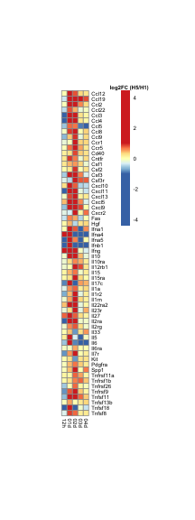

Load required packages

```r
suppressPackageStartupMessages(library(package = "knitr"))
suppressPackageStartupMessages(library(package = "biomaRt"))
suppressPackageStartupMessages(library(package = "pheatmap"))
suppressPackageStartupMessages(library(package = "gtable"))
suppressPackageStartupMessages(library(package = "grid"))
suppressPackageStartupMessages(library(package = "edgeR"))
suppressPackageStartupMessages(library(package = "tidyverse"))
```

Define session options

```r
workDir <- dirname(getwd())
opts_chunk$set(tidy = FALSE, fig.path = "../figure/")
options(stringsAsFactors = FALSE)
```

Load DGEGLM list

```r
load(file = file.path(workDir, "output/fluomics.fits.RData"))
```

Load GSEA output

```r
load(file = file.path(workDir, "output/fluomics.gseaOutput.RData"))
# print significant association between cytokines and H5 vs H1 diff.
filter(gseaOutput, NAME %in% "CYTOKINE_REGISTRY") %>%
  filter(`FDR q-val` <= 0.05) %>%
  select(coefName, NAME, NES , `NOM p-val`, `FDR q-val`) %>%
  print()
```

```
##            coefName              NAME       NES   NOM p-val   FDR q-val
## 1 H5N1.01d-H1N1.01d CYTOKINE_REGISTRY  2.671809 0.000000000 0.000000000
## 2 H5N1.02d-H1N1.02d CYTOKINE_REGISTRY  1.881007 0.000000000 0.000000000
## 3 H5N1.12h-H1N1.12h CYTOKINE_REGISTRY -1.604650 0.001042753 0.001042753
```

Plot heatmap of leading edge genes

```r
# extract DGEGLM comparing H5N1 to H1N1
fit <- fits[["virus"]][["fit"]]
# convert mouse genes to human genes
human <- useMart(biomart = "ensembl",
                 dataset = "hsapiens_gene_ensembl")
mouse <- useMart(biomart = "ensembl",
                 dataset = "mmusculus_gene_ensembl")
mouseGeneIds <- rownames(fit)
mouse2human <- getLDS(attributes  = c("mgi_symbol", "ensembl_gene_id"),
                      filters     = "ensembl_gene_id",
                      values      = mouseGeneIds,
                      mart        = mouse,
                      attributesL = "hgnc_symbol",
                      martL       = human)
# extract leading edge genes
leGenes <- filter(gseaOutput,
		  NAME %in% "CYTOKINE_REGISTRY" &
		    coefName %in% "H5N1.02d-H1N1.02d") %>%
  .$LEADING_EDGE %>%
  strsplit(split = ",") %>%
  unlist() %>%
  data.frame(symbol = .) %>%
  merge(y = mouse2human, by.x = "symbol", by.y = "HGNC.symbol") %>%
  arrange(MGI.symbol) %>%
  filter(!duplicated(Gene.stable.ID))

fcDF <- lapply(colnames(fit$contrast), FUN = function(contrastName) {
  top  <- glmLRT(fit, contrast = fit$contrast[, contrastName]) %>%
    topTags(n = Inf) %>%
    as.data.frame() %>%
    rownames_to_column() %>%
    filter(rowname %in% leGenes$Gene.stable.ID) %>%
    mutate(coefName = contrastName) %>%
    select(rowname, logFC, coefName)
  return(value = top)
}) %>%
  do.call(what = rbind) %>%
  mutate(coefName = gsub(pattern = ".+\\.([^\\.]+)$",
			 replacement = "\\1",
			 coefName),
	 coefName = factor(coefName),
	 coefName = relevel(coefName, ref = "12h")) %>% 
  spread(coefName, logFC) %>%
  column_to_rownames(var = "rowname")

breakLS <- c(-1 * max(abs(fcDF)),
             seq(from = -1, to = 1, length.out = 99),
             max(abs(fcDF)))
pheat <- pheatmap(mat = fcDF[leGenes$Gene.stable.ID, ],
		  breaks = breakLS,
		  cluster_cols = FALSE,
		  cluster_rows = FALSE,
		  cellwidth = 6,
		  cellheight = 6,
		  fontsize = 6,
		  labels_row = leGenes$MGI.symbol,
		  silent = TRUE)
colorName <- textGrob(label = "log2FC (H5/H1)",
                      x     = 0.5,
                      y     = 1.01,
                      gp    = gpar(fontface = "bold"))
pheat$gtable <- gtable_add_grob(pheat$gtable,
                                 colorName,
                                 t    = 4,
                                 l    = 5,
                                 b    = 5,
                                 clip = "off",
                                 name = "colorName")
grid.draw(pheat$gtable)
```



Print session info

```r
sessionInfo()
```

```
## R version 3.5.3 (2019-03-11)
## Platform: x86_64-apple-darwin18.2.0 (64-bit)
## Running under: macOS Mojave 10.14.4
## 
## Matrix products: default
## BLAS/LAPACK: /usr/local/Cellar/openblas/0.3.5/lib/libopenblasp-r0.3.5.dylib
## 
## locale:
## [1] en_US.UTF-8/en_US.UTF-8/en_US.UTF-8/C/en_US.UTF-8/en_US.UTF-8
## 
## attached base packages:
## [1] grid      stats     graphics  grDevices utils     datasets  methods  
## [8] base     
## 
## other attached packages:
##  [1] forcats_0.4.0   stringr_1.4.0   dplyr_0.8.0.1   purrr_0.3.2    
##  [5] readr_1.3.1     tidyr_0.8.3     tibble_2.1.1    ggplot2_3.1.0  
##  [9] tidyverse_1.2.1 edgeR_3.24.3    limma_3.38.3    gtable_0.2.0   
## [13] pheatmap_1.0.12 biomaRt_2.38.0  knitr_1.22     
## 
## loaded via a namespace (and not attached):
##  [1] Rcpp_1.0.1           locfit_1.5-9.1       lubridate_1.7.4     
##  [4] lattice_0.20-38      prettyunits_1.0.2    assertthat_0.2.0    
##  [7] digest_0.6.18        R6_2.4.0             cellranger_1.1.0    
## [10] plyr_1.8.4           backports_1.1.3      stats4_3.5.3        
## [13] RSQLite_2.1.1        evaluate_0.13        highr_0.7           
## [16] httr_1.4.0           pillar_1.3.1         rlang_0.3.1         
## [19] progress_1.2.0       curl_3.3             lazyeval_0.2.2      
## [22] readxl_1.3.1         rstudioapi_0.9.0     blob_1.1.1          
## [25] S4Vectors_0.20.1     RCurl_1.95-4.12      bit_1.1-14          
## [28] munsell_0.5.0        broom_0.5.1          compiler_3.5.3      
## [31] modelr_0.1.4         xfun_0.5             pkgconfig_2.0.2     
## [34] BiocGenerics_0.28.0  tidyselect_0.2.5     IRanges_2.16.0      
## [37] XML_3.98-1.19        withr_2.1.2          crayon_1.3.4        
## [40] bitops_1.0-6         nlme_3.1-137         jsonlite_1.6        
## [43] DBI_1.0.0            magrittr_1.5         scales_1.0.0        
## [46] cli_1.1.0            stringi_1.4.3        xml2_1.2.0          
## [49] generics_0.0.2       RColorBrewer_1.1-2   tools_3.5.3         
## [52] bit64_0.9-7          Biobase_2.42.0       glue_1.3.1          
## [55] hms_0.4.2            parallel_3.5.3       AnnotationDbi_1.44.0
## [58] colorspace_1.4-1     rvest_0.3.2          memoise_1.1.0       
## [61] haven_2.1.0
```
