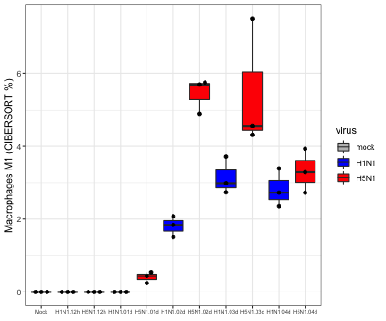
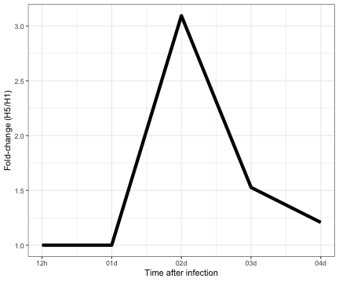

Load required packages

```r
suppressPackageStartupMessages(library(package = "knitr"))
suppressPackageStartupMessages(library(package = "biomaRt"))
suppressPackageStartupMessages(library(package = "EDASeq"))
suppressPackageStartupMessages(library(package = "edgeR"))
suppressPackageStartupMessages(library(package = "Rserve"))
suppressPackageStartupMessages(library(package = "ggbeeswarm"))
suppressPackageStartupMessages(library(package = "tidyverse"))
```

Define session options

```r
workDir <- dirname(getwd())
opts_chunk$set(tidy = FALSE, fig.path = "../figure/")
options(readr.num_columns = 0,
	stringsAsFactors  = FALSE)
```

Load raw gene counts

```r
load(file = file.path(workDir, "output/fluomics.seqSetRaw.RData"))
```

Normalized raw counts using the RPKM method

```r
dge <- DGEList(counts = counts(seqSetRaw))
dge <- calcNormFactors(object = dge, method = "TMM")
# read genes length
mouseGeneIds <- featureNames(seqSetRaw)
geneLength <- read_tsv(file = file.path(workDir, "input/mart_export.txt"))
geneLength  <- geneLength[match(mouseGeneIds, geneLength$"Gene stable ID"), ]
normMat <- rpkm(dge,
		gene.length          =
		  geneLength$"Transcript length (including UTRs and CDS)",
		normalized.lib.sizes = TRUE,
		log                  = FALSE,
		prior.count          = 2)
```

Convert mouse genes to human genes

```r
human <- useMart("ensembl", dataset = "hsapiens_gene_ensembl")
mouse <- useMart("ensembl", dataset = "mmusculus_gene_ensembl")
mouse2human <- getLDS(attributes  = c("ensembl_gene_id", "mgi_symbol"),
		      filters     = "ensembl_gene_id",
		      values      = mouseGeneIds,
		      mart        = mouse,
		      attributesL = "hgnc_symbol",
		      martL       = human,
		      uniqueRows  = TRUE)
# average normalized counts for ambiguous genes (genes having multiple mouse homolog) 
humanMat <- normMat %>%
  as.data.frame() %>%
  rownames_to_column() %>%
  gather(cname, value, -rowname) %>%
  merge(y = mouse2human, by.x = "rowname", by.y = "Gene.stable.ID") %>%
  group_by(HGNC.symbol, cname) %>%
  summarize(mu = mean(value)) %>%
  spread(cname, mu) %>%
  column_to_rownames(var = "HGNC.symbol")
```

Unzip CIBERSORT package

```r
unzip(zipfile = file.path(workDir, "utils/CIBERSORT_package.zip"),
      exdir   = file.path(workDir, "utils/CIBERSORT"))
```

Prepare CIBERSORT input files

```r
lm22 <- read_tsv(file = file.path(workDir, "utils/CIBERSORT/LM22.txt"))
sub22 <- lm22[lm22$"Gene symbol" %in% rownames(humanMat), ]
subMat <- humanMat[sub22$"Gene symbol", ] %>%
  as.data.frame() %>%
  rownames_to_column() %>%
  rename(GeneSymbol = rowname)
# write gene counts and cell subsets signature in CIBERSORT directory
write_tsv(sub22, path = file.path(workDir, "utils/CIBERSORT/lung.lm22.txt"))
write_tsv(subMat, path = file.path(workDir, "utils/CIBERSORT/lung.exprs.txt"))
```

Lauch CIBERSORT

```r
Rserve(args = "--no-save --quiet --slave")
```

```
## Starting Rserve:
##  /usr/local/Cellar/r/3.5.3/lib/R/bin/R CMD /usr/local/lib/R/3.5/site-library/Rserve/libs//Rserve --no-save --quiet --slave
```

```r
cmd <- paste("java -Xmx3g -Xms3g -jar",
             file.path(workDir, "utils/CIBERSORT/CIBERSORT.jar"),
             "-M",
	     file.path(workDir, "utils/CIBERSORT/lung.exprs.txt"),
	     "-B",
	     file.path(workDir, "utils/CIBERSORT/lung.lm22.txt"))
# read output
freqLS <- system(command = cmd, intern = TRUE)
skip <- max(grep(pattern = "CIBERSORT", freqLS))
freqLS <- freqLS[-seq(to = skip)]
head <- strsplit(freqLS[1], split = "\t") %>%
  unlist()
freqDF <- strsplit(freqLS[-1], split = "\t") %>%
  do.call(what = rbind) %>%
  as.data.frame() %>%
  setNames(nm = head) %>%
  mutate(Column = colnames(humanMat))
# save ouput
save(freqDF, file = file.path(workDir, "output/fluomics.cibersort.RData"))
```

Plot Macrophage M1 frequencies

```r
plotDF <- select(freqDF,
                 Column,
		 `Macrophages M1`) %>%
  gather(cname, freq, -Column) %>%
  mutate(freq = as.numeric(freq)) %>%
  merge(y = pData(seqSetRaw), by.x = "Column", by.y = "Run") %>%
  filter(virus != "H3N2") %>%
  mutate(time_point = factor(time_point),
	 time_point = relevel(time_point, ref = "12h"),
	 virus = factor(virus, levels =c("mock", "H1N1", "H5N1"))) %>%
  arrange(time_point, virus) %>%
  mutate(goi = paste0(virus, ".", time_point),
	 goi = gsub(pattern = "mock.04d", replacement = "Mock", goi),
	 goi = factor(goi, levels = unique(goi)),
	 goi = relevel(goi, ref = "Mock"))

ggplot(data = plotDF,
       mapping = aes(x = goi,
                     y = freq * 100)) +
  geom_boxplot(mapping = aes(fill = virus), outlier.color = "transparent") +
  geom_beeswarm(cex = 2) +
  labs(x = NULL, y = "Macrophages M1 (CIBERSORT %)") +
  scale_fill_manual(values = c("grey", "blue", "red")) +
  theme_bw() +
  theme(axis.text.x = element_text(size = 6))
```



Plot Macrophage M1 fold-induction between H5N1 and H1N1

```r
plotDF2 <- plotDF %>%
  select(cname, time_point, virus, freq) %>%
  group_by(cname, time_point, virus) %>%
  summarize(q2 = median(freq)) %>%
  spread(virus, q2) %>%
  mutate(fc = pmax(H5N1, 0.01)/pmax(H1N1, 0.01),
	 x = as.numeric(time_point))

ggplot(data = plotDF2,
       mapping = aes(x = x, y = fc)) +
  geom_line(size = 2) +
  scale_x_continuous(labels = levels(plotDF2$time_point)) +
  labs(x = "Time after infection", y = "Fold-change (H5/H1)") +
  theme_bw()
```




Delete temporary files

```r
unlink(file.path(workDir, "utils/CIBERSORT"), recursive = TRUE)
```

Print session info

```r
sessionInfo()
```

```
## R version 3.5.3 (2019-03-11)
## Platform: x86_64-apple-darwin18.2.0 (64-bit)
## Running under: macOS Mojave 10.14.4
## 
## Matrix products: default
## BLAS/LAPACK: /usr/local/Cellar/openblas/0.3.5/lib/libopenblasp-r0.3.5.dylib
## 
## locale:
## [1] en_US.UTF-8/en_US.UTF-8/en_US.UTF-8/C/en_US.UTF-8/en_US.UTF-8
## 
## attached base packages:
## [1] stats4    parallel  stats     graphics  grDevices utils     datasets 
## [8] methods   base     
## 
## other attached packages:
##  [1] forcats_0.4.0               stringr_1.4.0              
##  [3] dplyr_0.8.0.1               purrr_0.3.2                
##  [5] readr_1.3.1                 tidyr_0.8.3                
##  [7] tibble_2.1.1                tidyverse_1.2.1            
##  [9] ggbeeswarm_0.6.0            ggplot2_3.1.0              
## [11] Rserve_1.8-6                edgeR_3.24.3               
## [13] limma_3.38.3                EDASeq_2.16.3              
## [15] ShortRead_1.40.0            GenomicAlignments_1.18.1   
## [17] SummarizedExperiment_1.12.0 DelayedArray_0.8.0         
## [19] matrixStats_0.54.0          Rsamtools_1.34.1           
## [21] GenomicRanges_1.34.0        GenomeInfoDb_1.18.2        
## [23] Biostrings_2.50.2           XVector_0.22.0             
## [25] IRanges_2.16.0              S4Vectors_0.20.1           
## [27] BiocParallel_1.16.6         Biobase_2.42.0             
## [29] BiocGenerics_0.28.0         biomaRt_2.38.0             
## [31] knitr_1.22                 
## 
## loaded via a namespace (and not attached):
##  [1] nlme_3.1-137           bitops_1.0-6           lubridate_1.7.4       
##  [4] bit64_0.9-7            RColorBrewer_1.1-2     progress_1.2.0        
##  [7] httr_1.4.0             backports_1.1.3        tools_3.5.3           
## [10] R6_2.4.0               vipor_0.4.5            DBI_1.0.0             
## [13] lazyeval_0.2.2         colorspace_1.4-1       withr_2.1.2           
## [16] tidyselect_0.2.5       prettyunits_1.0.2      curl_3.3              
## [19] bit_1.1-14             compiler_3.5.3         cli_1.1.0             
## [22] rvest_0.3.2            xml2_1.2.0             labeling_0.3          
## [25] rtracklayer_1.42.2     scales_1.0.0           genefilter_1.64.0     
## [28] DESeq_1.34.1           digest_0.6.18          R.utils_2.8.0         
## [31] pkgconfig_2.0.2        highr_0.7              readxl_1.3.1          
## [34] rlang_0.3.1            rstudioapi_0.9.0       RSQLite_2.1.1         
## [37] generics_0.0.2         jsonlite_1.6           hwriter_1.3.2         
## [40] R.oo_1.22.0            RCurl_1.95-4.12        magrittr_1.5          
## [43] GenomeInfoDbData_1.2.0 Matrix_1.2-15          Rcpp_1.0.1            
## [46] munsell_0.5.0          R.methodsS3_1.7.1      stringi_1.4.3         
## [49] zlibbioc_1.28.0        plyr_1.8.4             grid_3.5.3            
## [52] blob_1.1.1             crayon_1.3.4           lattice_0.20-38       
## [55] haven_2.1.0            splines_3.5.3          GenomicFeatures_1.34.6
## [58] annotate_1.60.1        hms_0.4.2              locfit_1.5-9.1        
## [61] pillar_1.3.1           geneplotter_1.60.0     XML_3.98-1.19         
## [64] glue_1.3.1             evaluate_0.13          latticeExtra_0.6-28   
## [67] modelr_0.1.4           cellranger_1.1.0       gtable_0.2.0          
## [70] assertthat_0.2.0       xfun_0.5               aroma.light_3.12.0    
## [73] xtable_1.8-3           broom_0.5.1            survival_2.43-3       
## [76] AnnotationDbi_1.44.0   beeswarm_0.2.3         memoise_1.1.0
```
