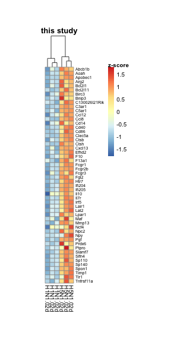

Load required packages

```r
suppressPackageStartupMessages(library(package = "knitr"))
suppressPackageStartupMessages(library(package = "EDASeq"))
suppressPackageStartupMessages(library(package = "biomaRt"))
suppressPackageStartupMessages(library(package = "RCurl"))
suppressPackageStartupMessages(library(package = "readxl"))
suppressPackageStartupMessages(library(package = "GEOquery"))
suppressPackageStartupMessages(library(package = "edgeR"))
suppressPackageStartupMessages(library(package = "pheatmap"))
suppressPackageStartupMessages(library(package = "gtable"))
suppressPackageStartupMessages(library(package = "grid"))
suppressPackageStartupMessages(library(package = "tidyverse"))
```

Define session options

```r
workDir <- dirname(getwd())
opts_chunk$set(tidy = FALSE, fig.path = "../figure/")
options(stringsAsFactors  = FALSE,
	readr.num_columns = 0)
```

Load GSEA output

```r
load(file = file.path(workDir, "output/fluomics.gseaOutput.RData"))
```

Print significant Macrophage genesets enriched in H5N1 vs H1N1 at Day 2

```r
gseaOutput %>%
  filter(grepl(pattern = "Macrophage", rpt) &
	   coefName %in% "H5N1.02d-H1N1.02d" &
	   grepl(pattern = "MOULD_DAY_3|MISHARIN", NAME) &
	   `FDR q-val` <= 0.05) %>%
  select(NAME, NES, `FDR q-val`, coefName)
```

```
##                                     NAME       NES    FDR q-val
## 1                   MISHARIN_CLUSTER_III  1.626966 0.0003047619
## 2        MOULD_DAY_3_REC_VS_DAY_3_RES_DN -1.258471 0.0266949240
## 3 MOULD_DAY_3_REC_VS_DAY_3_RES_TOP200_UP  2.413144 0.0000000000
## 4        MOULD_DAY_3_REC_VS_DAY_3_RES_UP  2.388120 0.0000000000
##            coefName
## 1 H5N1.02d-H1N1.02d
## 2 H5N1.02d-H1N1.02d
## 3 H5N1.02d-H1N1.02d
## 4 H5N1.02d-H1N1.02d
```

Convert mouse genes to human genes

```r
humanGenes <- gseaOutput$LEADING_EDGE %>%
  strsplit(",") %>%
  unlist() %>%
  unique()
human <- useMart("ensembl", dataset = "hsapiens_gene_ensembl")
mouse <- useMart("ensembl", dataset = "mmusculus_gene_ensembl")
human2mouse <- getLDS(attributes  = "hgnc_symbol",
		      filters     = "hgnc_symbol",
		      values      = humanGenes,
		      mart        = human,
		      attributesL = c("ensembl_gene_id", "mgi_symbol"),
		      martL       = mouse,
		      uniqueRows  = TRUE)
```

Load normalized gene counts

```r
load(file = file.path(workDir, "output/fluomics.seqSet.RData"))
```

Load GLMLRT list

```r
load(file = file.path(workDir, "output/fluomics.fits.RData"))
```

Extract gene counts for Misharin dataset

```r
# download Misharin et al Supplementary Tables
zipURL <- file.path("http://jem.rupress.org/highwire/filestream/128076",
		    "field_highwire_adjunct_files/0",
		    "JEM_20162152_TablesS1-S6.zip")
zipBin <- getBinaryURL(url = zipURL, followlocation = TRUE)
zipFile <- basename(zipURL)
zipCon <- file(zipFile, open = "wb")
writeBin(zipBin, zipCon)
close(zipCon)

# read Table S2
zipDir <- unzip(zipfile = zipFile)
misharinDF <- grep(pattern = "TableS2", zipDir, value = TRUE) %>%
  read_excel(.name_repair = make.unique) %>%
  select(-`K-assignment`, -contains(match = "Anova")) %>%
  as.data.frame() %>%
  column_to_rownames(var = "Symbol")
misharinAnnotDF <- data.frame(orig.cname = colnames(misharinDF)) %>%
  mutate(cname = gsub(pattern = "(.+)_tr_am_d19_rep([0-4])$",
		      replacement = "\\1_tr_am_d14_rep\\2",
		      orig.cname),
	 Subset = gsub(pattern     = "WT_(.+)_d.+",
		       replacement = "\\1",
		       cname),
	 Timepoint = gsub(pattern = ".+_(d[0-9]+).+",
			 replacement = "\\1",
			 cname))
# clean up
unlink(zipFile)
unlink(unique(dirname(zipDir)), recursive = TRUE)
```

Read Mould count file

```r
supFileLS <- getGEOSuppFiles(GEO           = "GSE94749",
			     filter_regex  = "htseq-genecounts.txt",
			     makeDirectory = FALSE) %>%
  rownames_to_column()
countFile <- basename(supFileLS$rowname)

mouldDF <- read_tsv(file = countFile) %>%
  as.data.frame() %>%
  column_to_rownames(var = "GeneID")

mouldAnnotDF <- data.frame(condition = gsub(pattern = "_rep[0-9]",
                                       replacement = "",
                                       names(mouldDF)),
		      rowname   = names(mouldDF)) %>%
  mutate(condition = factor(condition)) %>%
  column_to_rownames(var = "rowname")
# clean up
unlink(countFile)
```

Identify leading edge genes

```r
leGenes <- gseaOutput %>%
  filter(grepl(pattern = "Macrophage", rpt) &
           coefName %in% "H5N1.02d-H1N1.02d" &
           grepl(pattern = "MOULD_DAY_3.+TOP200_UP|MISHARIN", NAME) &
           `FDR q-val` <= 0.05)
leGenes$LEADING_EDGE %>%
  strsplit(split = ",") %>%
  setNames(nm = leGenes$NAME) %>%
  stack() %>%
  select(values) %>%
  filter(!duplicated(values)) -> leGenes
leGenes <- merge(x = leGenes,
      y = human2mouse,
      by.x = "values",
      by.y = "HGNC.symbol")
# filter on deg in fluomics
fit <- fits[["virus"]][["fit"]]
fit2 <- glmLRT(glmfit = fit, contrast = fit$contrast[, "H5N1.02d-H1N1.02d"])
top <- topTags(fit2, n = Inf, p.value = 0.05) %>%
  as.data.frame() %>%
  rownames_to_column() %>%
  filter(logFC > 0)
leGenes <- filter(leGenes, Gene.stable.ID %in% top$rowname)
# filter on genes annotated in all expression matrix
leGenes <- leGenes %>%
  filter(Gene.stable.ID %in% featureNames(seqSet)) %>%
  filter(Gene.stable.ID %in% rownames(misharinDF)) %>%
  filter(Gene.stable.ID %in% rownames(mouldDF)) %>%
  filter(!duplicated(Gene.stable.ID))
# filter on macrophages markers
generifPath <- file.path(workDir, "utils/generifs_basic")
generif <- scan(file = generifPath, what = "raw", sep = "\n")
generif <- generif %>%
  strsplit(split = "\t") %>%
  do.call(what = rbind)
header <- generif[1, ] %>%
  gsub(pattern = "#", replacement = "")
generif <- generif[-1, ] %>%
  as.data.frame() %>%
  setNames(header)
humanGeneIds <- getBM(mart       = human,
		      attributes = c("entrezgene", "hgnc_symbol"),
		      filters    = "hgnc_symbol",
		      values     = leGenes$values)
mouseGeneIds <- getBM(mart       = mouse,
                      attributes = c("entrezgene", "mgi_symbol"),
                      filters    = "mgi_symbol",
                      values     = leGenes$MGI.symbol) %>%
  rename(mouse.entrezid = entrezgene)
generifTemp <- leGenes %>%
  merge(y     = humanGeneIds,
        by.x  = "values",
	by.y  = "hgnc_symbol",
        all.x = TRUE) %>%
  merge(y     = mouseGeneIds,
        by.x  = "MGI.symbol",
	by.y  = "mgi_symbol",
        all.x = TRUE) %>%
  merge(y     = generif,
	by.x  = "entrezgene",
	by.y  = "Gene ID",
	all.x = TRUE) %>%
  merge(y     = generif,
        by.x  = "mouse.entrezid",
        by.y = "Gene ID",
        all.x = TRUE,
	suffix = c(".human", ".mice")) %>%
  filter(grepl(pattern = "macrophage", `GeneRIF text.human`, ignore.case = TRUE) |
	   grepl(pattern = "macrophage", `GeneRIF text.mice`, ignore.case = TRUE))
macroDF <- select(generifTemp, Gene.stable.ID, MGI.symbol) %>%
  distinct() %>%
  arrange(MGI.symbol)
```


```r
mat <- normCounts(seqSet)[macroDF$Gene.stable.ID,
			  seqSet$time_point %in% "02d" &
			    seqSet$virus != "H3N2"]
mat <- t(scale(t(mat)))

cNames <- pData(seqSet)[colnames(mat), ] %>%
  mutate(cname = paste0(virus, ".", time_point)) %>%
  .$cname
breakLS <- c(-1 * max(abs(mat)),
	     seq(from       = -1 * min(abs(range(mat))),
		 to         = min(abs(range(mat))),
		 length.out = 99),
	     max(abs(mat)))
pheat <- pheatmap(mat,
		  cellwidth    = 8,
		  breaks       = breakLS,
		  labels_col   = cNames,
		  labels_row   = macroDF$MGI.symbol,
		  fontsize_row = 7,
		  cellheight   = 7,
		  main         = "this study",
		  cluster_rows = FALSE,
		  silent       = TRUE)
colorName <- textGrob(label = "z-score",
                      x     = 0.5,
                      y     = 1.01,
                      gp    = gpar(fontface = "bold"))
pheat$gtable <- gtable_add_grob(pheat$gtable,
                                 colorName,
                                 t    = 4,
                                 l    = 5,
                                 b    = 5,
                                 clip = "off",
                                 name = "colorName")
grid.draw(pheat$gtable)
```




```r
mat <- misharinDF[macroDF$Gene.stable.ID,
		  misharinAnnotDF$Subset %in% c("mo_am", "tr_am") &
		    misharinAnnotDF$Timepoint %in% "d14"]
mat <- t(scale(t(mat)))

cNames <- misharinAnnotDF[match(colnames(mat),
				table = misharinAnnotDF$orig.cname),
			  "cname"] %>%
  gsub(pattern = "WT_|_rep.+", replacement = "")

breakLS <- c(-1 * max(abs(mat)),
	     seq(from       = -1 * min(abs(range(mat))),
		 to         = min(abs(range(mat))),
		 length.out = 99),
	     max(abs(mat)))
pheat <- pheatmap(mat,
		  cellwidth    = 8,
		  breaks       = breakLS,
		  labels_col   = cNames,
		  labels_row   = macroDF$MGI.symbol,
		  fontsize_row = 7,
		  cellheight   = 7,
		  main         = "Misharin et al.",
		  cluster_rows = FALSE,
		  silent       = TRUE)
colorName <- textGrob(label = "z-score",
                      x     = 0.5,
                      y     = 1.01,
                      gp    = gpar(fontface = "bold"))
pheat$gtable <- gtable_add_grob(pheat$gtable,
                                 colorName,
                                 t    = 4,
                                 l    = 5,
                                 b    = 5,
                                 clip = "off",
                                 name = "colorName")
grid.draw(pheat$gtable)
```


```r
mat <- mouldDF[macroDF$Gene.stable.ID,
	       grepl(pattern = "Day_3", mouldAnnotDF$condition)]
mat <- t(scale(t(mat)))

cNames <- gsub(pattern     = "_rep.+",
	       replacement = "",
	       colnames(mat)) 

breakLS <- c(-1 * max(abs(mat)),
	     seq(from       = -1 * min(abs(range(mat))),
		 to         = min(abs(range(mat))),
		 length.out = 99),
	     max(abs(mat)))
pheat <- pheatmap(mat,
		  cellwidth    = 8,
		  breaks       = breakLS,
		  labels_col   = cNames,
		  labels_row   = macroDF$MGI.symbol,
		  fontsize_row = 7,
		  cellheight   = 7,
		  main         = "Mould et al.",
		  cluster_rows = FALSE,
		  silent       = TRUE)
colorName <- textGrob(label = "z-score",
                      x     = 0.5,
                      y     = 1.01,
                      gp    = gpar(fontface = "bold"))
pheat$gtable <- gtable_add_grob(pheat$gtable,
                                 colorName,
                                 t    = 4,
                                 l    = 5,
                                 b    = 5,
                                 clip = "off",
                                 name = "colorName")
grid.draw(pheat$gtable)
```


Print session info

```r
sessionInfo()
```

```
## R version 3.5.3 (2019-03-11)
## Platform: x86_64-apple-darwin18.2.0 (64-bit)
## Running under: macOS Mojave 10.14.4
## 
## Matrix products: default
## BLAS/LAPACK: /usr/local/Cellar/openblas/0.3.5/lib/libopenblasp-r0.3.5.dylib
## 
## locale:
## [1] en_US.UTF-8/en_US.UTF-8/en_US.UTF-8/C/en_US.UTF-8/en_US.UTF-8
## 
## attached base packages:
##  [1] grid      stats4    parallel  stats     graphics  grDevices utils    
##  [8] datasets  methods   base     
## 
## other attached packages:
##  [1] forcats_0.4.0               stringr_1.4.0              
##  [3] dplyr_0.8.0.1               purrr_0.3.2                
##  [5] readr_1.3.1                 tidyr_0.8.3                
##  [7] tibble_2.1.1                ggplot2_3.1.0              
##  [9] tidyverse_1.2.1             gtable_0.2.0               
## [11] pheatmap_1.0.12             edgeR_3.24.3               
## [13] limma_3.38.3                GEOquery_2.50.5            
## [15] readxl_1.3.1                RCurl_1.95-4.12            
## [17] bitops_1.0-6                biomaRt_2.38.0             
## [19] EDASeq_2.16.3               ShortRead_1.40.0           
## [21] GenomicAlignments_1.18.1    SummarizedExperiment_1.12.0
## [23] DelayedArray_0.8.0          matrixStats_0.54.0         
## [25] Rsamtools_1.34.1            GenomicRanges_1.34.0       
## [27] GenomeInfoDb_1.18.2         Biostrings_2.50.2          
## [29] XVector_0.22.0              IRanges_2.16.0             
## [31] S4Vectors_0.20.1            BiocParallel_1.16.6        
## [33] Biobase_2.42.0              BiocGenerics_0.28.0        
## [35] knitr_1.22                 
## 
## loaded via a namespace (and not attached):
##  [1] nlme_3.1-137           lubridate_1.7.4        bit64_0.9-7           
##  [4] RColorBrewer_1.1-2     progress_1.2.0         httr_1.4.0            
##  [7] tools_3.5.3            backports_1.1.3        R6_2.4.0              
## [10] DBI_1.0.0              lazyeval_0.2.2         colorspace_1.4-1      
## [13] withr_2.1.2            tidyselect_0.2.5       prettyunits_1.0.2     
## [16] curl_3.3               bit_1.1-14             compiler_3.5.3        
## [19] cli_1.1.0              rvest_0.3.2            xml2_1.2.0            
## [22] rtracklayer_1.42.2     scales_1.0.0           genefilter_1.64.0     
## [25] DESeq_1.34.1           digest_0.6.18          R.utils_2.8.0         
## [28] pkgconfig_2.0.2        highr_0.7              rlang_0.3.1           
## [31] rstudioapi_0.9.0       RSQLite_2.1.1          generics_0.0.2        
## [34] jsonlite_1.6           hwriter_1.3.2          R.oo_1.22.0           
## [37] magrittr_1.5           GenomeInfoDbData_1.2.0 Matrix_1.2-15         
## [40] Rcpp_1.0.1             munsell_0.5.0          R.methodsS3_1.7.1     
## [43] stringi_1.4.3          zlibbioc_1.28.0        plyr_1.8.4            
## [46] blob_1.1.1             crayon_1.3.4           lattice_0.20-38       
## [49] haven_2.1.0            splines_3.5.3          GenomicFeatures_1.34.6
## [52] annotate_1.60.1        hms_0.4.2              locfit_1.5-9.1        
## [55] pillar_1.3.1           geneplotter_1.60.0     XML_3.98-1.19         
## [58] glue_1.3.1             evaluate_0.13          latticeExtra_0.6-28   
## [61] modelr_0.1.4           cellranger_1.1.0       assertthat_0.2.0      
## [64] xfun_0.5               aroma.light_3.12.0     xtable_1.8-3          
## [67] broom_0.5.1            survival_2.43-3        AnnotationDbi_1.44.0  
## [70] memoise_1.1.0
```
