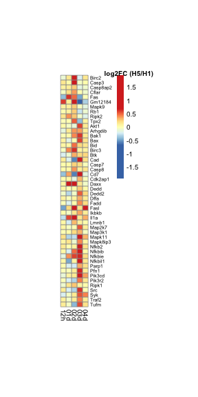

Load required packages

```r
suppressPackageStartupMessages(library(package = "knitr"))
suppressPackageStartupMessages(library(package = "GSEABase"))
suppressPackageStartupMessages(library(package = "biomaRt"))
suppressPackageStartupMessages(library(package = "EDASeq"))
suppressPackageStartupMessages(library(package = "edgeR"))
suppressPackageStartupMessages(library(package = "pheatmap"))
suppressPackageStartupMessages(library(package = "gtable"))
suppressPackageStartupMessages(library(package = "grid"))
suppressPackageStartupMessages(library(package = "tidyverse"))
```

Define session options

```r
workDir <- dirname(getwd())
opts_chunk$set(tidy = FALSE, fig.path = "../figure/")
options(stringsAsFactors  = FALSE,
	readr.num_columns = 0)
```

Load GSEA output

```r
load(file = file.path(workDir, "output/fluomics.gseaOutput.RData"))
```

Read MSigDB genesets description and identify FAS-related genesets

```r
xmlFile <- file.path(workDir, "utils/msigdb_v6.2.xml")
msig <- getBroadSets(uri = xmlFile)
descDF <- sapply(msig, FUN = description) %>%
  data.frame(DESC = .) %>%
  mutate(NAME = names(msig))

gsNames <- descDF %>%
  filter((grepl(pattern = "FAS_", NAME)))
```

Print FAS-related genesets enriched in H5N1 vs H1N1 at Day 2

```r
gseaOutput %>%
  filter(NAME %in% gsNames$NAME & `FDR q-val` <= 0.25) %>%
  select(NAME, NES, `FDR q-val`, coefName)
```

```
##                       NAME      NES  FDR q-val          coefName
## 1     BIOCARTA_FAS_PATHWAY 1.407258 0.14245783 H5N1.02d-H1N1.02d
## 2          PID_FAS_PATHWAY 1.383827 0.16033992 H5N1.02d-H1N1.02d
## 3 ST_FAS_SIGNALING_PATHWAY 1.359979 0.17825767 H5N1.02d-H1N1.02d
## 4          PID_FAS_PATHWAY 1.494055 0.06099669 H5N1.03d-H1N1.03d
## 5 ST_FAS_SIGNALING_PATHWAY 1.500724 0.05836793 H5N1.03d-H1N1.03d
```
No genesets passed an FDR cutoff of 0.05; a relaxed FDR of 0.25 was used.
  
  
Convert mouse genes to human genes

```r
humanGenes <- gseaOutput$LEADING_EDGE %>%
  strsplit(",") %>%
  unlist() %>%
  unique()
human <- useMart("ensembl", dataset = "hsapiens_gene_ensembl")
mouse <- useMart("ensembl", dataset = "mmusculus_gene_ensembl")
human2mouse <- getLDS(attributes  = "hgnc_symbol",
		      filters     = "hgnc_symbol",
		      values      = humanGenes,
		      mart        = human,
		      attributesL = c("ensembl_gene_id", "mgi_symbol"),
		      martL       = mouse,
		      uniqueRows  = TRUE)
```

Load GLMLRT list

```r
load(file = file.path(workDir, "output/fluomics.fits.RData"))
```

Identify leading edge genes

```r
leGenes <- gseaOutput %>%
  filter(NAME %in% gsNames$NAME & `FDR q-val` <= 0.25)
leGenes$LEADING_EDGE %>%
  strsplit(split = ",") %>%
  setNames(nm = leGenes$NAME) %>%
  stack() %>%
  filter(!duplicated(values)) -> leGenes
leGenes <- merge(x    = leGenes,
		 y    = human2mouse,
		 by.x = "values",
		 by.y = "HGNC.symbol")
```

Plot heatmap

```r
fit <- fits[["virus"]][["fit"]]
top <- NULL
for (coefName in colnames(fit$contrast)) {
  topTemp <- glmLRT(glmfit = fit, contrast = fit$contrast[, coefName]) %>%
    topTags(n = Inf) %>%
    as.data.frame() %>%
    rownames_to_column() %>%
    filter(rowname %in% leGenes$Gene.stable.ID) %>%
    mutate(coefName = coefName) %>%
    select(rowname, logFC, coefName)
  top <- rbind(top, topTemp)
}
mat <- top %>%
  merge(y    = leGenes,
	by.x = "rowname",
	by.y = "Gene.stable.ID") %>%
  mutate(coefName = gsub(pattern = ".+\\.",
			 replacement = "",
			 coefName),
	 coefName = factor(coefName),
	 coefName = relevel(coefName, ref = "12h")) %>%
  select(MGI.symbol, logFC, coefName) %>%
  spread(coefName, logFC) %>%
  mutate(max = (`03d` > 0)) %>%
  arrange(max, MGI.symbol) %>%
  select(-max) %>%
  column_to_rownames(var = "MGI.symbol")

breakLS <- c(-1 * max(abs(mat)),
	     seq(from       = -0.5 * min(abs(range(mat))),
		 to         = 0.5 * min(abs(range(mat))),
		 length.out = 99),
	     max(abs(mat)))
pheat <- pheatmap(mat,
		  cellwidth    = 8,
		  breaks       = breakLS,
		  fontsize_row = 7,
		  cellheight   = 7,
		  cluster_rows = FALSE,
		  cluster_cols = FALSE,
		  silent       = TRUE)
colorName <- textGrob(label = "log2FC (H5/H1)",
                      x     = 0.5,
                      y     = 1.01,
                      gp    = gpar(fontface = "bold"))
pheat$gtable <- gtable_add_grob(pheat$gtable,
                                 colorName,
                                 t    = 4,
                                 l    = 5,
                                 b    = 5,
                                 clip = "off",
                                 name = "colorName")
grid.draw(pheat$gtable)
```



Print session info

```r
sessionInfo()
```

```
## R version 3.5.3 (2019-03-11)
## Platform: x86_64-apple-darwin18.2.0 (64-bit)
## Running under: macOS Mojave 10.14.4
## 
## Matrix products: default
## BLAS/LAPACK: /usr/local/Cellar/openblas/0.3.5/lib/libopenblasp-r0.3.5.dylib
## 
## locale:
## [1] en_US.UTF-8/en_US.UTF-8/en_US.UTF-8/C/en_US.UTF-8/en_US.UTF-8
## 
## attached base packages:
##  [1] grid      stats4    parallel  stats     graphics  grDevices utils    
##  [8] datasets  methods   base     
## 
## other attached packages:
##  [1] forcats_0.4.0               stringr_1.4.0              
##  [3] dplyr_0.8.0.1               purrr_0.3.2                
##  [5] readr_1.3.1                 tidyr_0.8.3                
##  [7] tibble_2.1.1                ggplot2_3.1.0              
##  [9] tidyverse_1.2.1             gtable_0.2.0               
## [11] pheatmap_1.0.12             edgeR_3.24.3               
## [13] limma_3.38.3                EDASeq_2.16.3              
## [15] ShortRead_1.40.0            GenomicAlignments_1.18.1   
## [17] SummarizedExperiment_1.12.0 DelayedArray_0.8.0         
## [19] matrixStats_0.54.0          Rsamtools_1.34.1           
## [21] GenomicRanges_1.34.0        GenomeInfoDb_1.18.2        
## [23] Biostrings_2.50.2           XVector_0.22.0             
## [25] BiocParallel_1.16.6         biomaRt_2.38.0             
## [27] GSEABase_1.44.0             graph_1.60.0               
## [29] annotate_1.60.1             XML_3.98-1.19              
## [31] AnnotationDbi_1.44.0        IRanges_2.16.0             
## [33] S4Vectors_0.20.1            Biobase_2.42.0             
## [35] BiocGenerics_0.28.0         knitr_1.22                 
## 
## loaded via a namespace (and not attached):
##  [1] nlme_3.1-137           bitops_1.0-6           lubridate_1.7.4       
##  [4] bit64_0.9-7            RColorBrewer_1.1-2     progress_1.2.0        
##  [7] httr_1.4.0             tools_3.5.3            backports_1.1.3       
## [10] R6_2.4.0               lazyeval_0.2.2         DBI_1.0.0             
## [13] colorspace_1.4-1       withr_2.1.2            tidyselect_0.2.5      
## [16] prettyunits_1.0.2      curl_3.3               bit_1.1-14            
## [19] compiler_3.5.3         cli_1.1.0              rvest_0.3.2           
## [22] xml2_1.2.0             rtracklayer_1.42.2     scales_1.0.0          
## [25] genefilter_1.64.0      DESeq_1.34.1           digest_0.6.18         
## [28] R.utils_2.8.0          pkgconfig_2.0.2        highr_0.7             
## [31] readxl_1.3.1           rlang_0.3.1            rstudioapi_0.9.0      
## [34] RSQLite_2.1.1          generics_0.0.2         jsonlite_1.6          
## [37] hwriter_1.3.2          R.oo_1.22.0            RCurl_1.95-4.12       
## [40] magrittr_1.5           GenomeInfoDbData_1.2.0 Matrix_1.2-15         
## [43] Rcpp_1.0.1             munsell_0.5.0          R.methodsS3_1.7.1     
## [46] stringi_1.4.3          zlibbioc_1.28.0        plyr_1.8.4            
## [49] blob_1.1.1             crayon_1.3.4           lattice_0.20-38       
## [52] haven_2.1.0            splines_3.5.3          GenomicFeatures_1.34.6
## [55] hms_0.4.2              locfit_1.5-9.1         pillar_1.3.1          
## [58] geneplotter_1.60.0     glue_1.3.1             evaluate_0.13         
## [61] latticeExtra_0.6-28    modelr_0.1.4           cellranger_1.1.0      
## [64] assertthat_0.2.0       xfun_0.5               aroma.light_3.12.0    
## [67] xtable_1.8-3           broom_0.5.1            survival_2.43-3       
## [70] memoise_1.1.0
```
