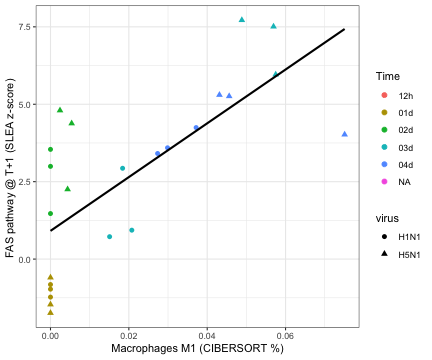

Load required packages

```r
suppressPackageStartupMessages(library(package = "knitr"))
suppressPackageStartupMessages(library(package = "GSEABase"))
suppressPackageStartupMessages(library(package = "EDASeq"))
suppressPackageStartupMessages(library(package = "biomaRt"))
suppressPackageStartupMessages(library(package = "tidyverse"))
```

Define session options

```r
workDir <- dirname(getwd())
opts_chunk$set(tidy = FALSE, fig.path = "../figure/")
options(stringsAsFactors  = FALSE,
        readr.num_columns = 0)
```

Load GSEA output

```r
load(file = file.path(workDir, "output/fluomics.gseaOutput.RData"))
```

Read MSigDB genesets description and identify FAS-related genesets

```r
xmlFile <- file.path(workDir, "utils/msigdb_v6.2.xml")
msig <- getBroadSets(uri = xmlFile)
descDF <- sapply(msig, FUN = description) %>%
  data.frame(DESC = .) %>%
  mutate(NAME = names(msig))

gsNames <- descDF %>%
  filter((grepl(pattern = "FAS_", NAME)))
```

Convert mouse genes to human genes

```r
humanGenes <- gseaOutput$LEADING_EDGE %>%
  strsplit(",") %>%
  unlist() %>%
  unique()
human <- useMart("ensembl", dataset = "hsapiens_gene_ensembl")
mouse <- useMart("ensembl", dataset = "mmusculus_gene_ensembl")
human2mouse <- getLDS(attributes  = "hgnc_symbol",
                      filters     = "hgnc_symbol",
                      values      = humanGenes,
                      mart        = human,
                      attributesL = c("ensembl_gene_id", "mgi_symbol"),
                      martL       = mouse,
                      uniqueRows  = TRUE)
```

Extract FAS genesets leading edge

```r
leGenes <- gseaOutput %>%
  filter(NAME %in% gsNames$NAME & `FDR q-val` <= 0.25)
leGenes$LEADING_EDGE %>%
  strsplit(split = ",") %>%
  setNames(nm = leGenes$NAME) %>%
  stack() %>%
  filter(!duplicated(values)) -> leGenes
leGenes <- merge(x    = leGenes,
                 y    = human2mouse,
                 by.x = "values",
                 by.y = "HGNC.symbol")
```

Load SeqExpressionSet

```r
load(file = file.path(workDir, "output/fluomics.seqSet.RData"))
```

Perform SLEA

```r
normMat <- normCounts(seqSet)
normMat <- t(scale(t(normMat)))
B <- 1000
gs <- intersect(leGenes$Gene.stable.ID, featureNames(seqSet))
ngenes <- length(gs)
mu <- colMeans(normMat[gs, ])
muPermut <- mclapply(1:B, FUN = function(seed) {
  set.seed(seed = seed)
  muHat <- colMeans(normMat[sample.int(nrow(normMat), ngenes), ],
                    na.rm = TRUE)
  return(value = muHat)
})
muPermut <- do.call(what = rbind, args = muPermut)
zscore <- (mu - colMeans(muPermut)) / apply(muPermut, MARGIN = 2, FUN = sd)
sleaDF <- data.frame(slea = zscore)
```

Load cibersort output

```r
load(file = file.path(workDir, "output/fluomics.cibersort.RData"))
```

Plot M1 vs FASE

```r
plotDF <- sleaDF %>%
  rownames_to_column() %>%
  merge(y = pData(seqSet), by.x = "rowname", by.y = "Run") %>%
  merge(y = freqDF, by.x = "rowname", by.y = "Column") %>%
  filter(virus %in% c("H1N1", "H5N1", "mock")) %>%
  mutate(`Macrophages M1` = as.numeric(`Macrophages M1`)) %>%
  select(rowname, slea, `Macrophages M1`, virus, time_point,
					biological_replicate)

fit <- cor.test(formula = ~slea+`Macrophages M1`,
		data    = plotDF,
		method  = "spearman")
 
ggplot(data = plotDF,
       mapping = aes(x = `Macrophages M1`, y = slea)) +
  geom_point(mapping = aes(color = time_point, shape = virus), size = 2) +
  geom_smooth(method = "lm", color = "black", se = FALSE) +
  labs(x     = "Macrophages M1 (CIBERSORT %)",
       y     = "FAS pathway [SLEA z-score]",
       title = paste0("Spearman cor: rho=",
		      signif(fit$estimate, digits = 3),
		      " p=",
		      signif(fit$p.value, digits = 3))) +
  theme_bw()
```


Plot M1 and FAS over time

```r
plotDF2 <- plotDF %>%
  rename(`FAS pathway (SLEA z-score)`   = slea,
         `Macrophages M1 (CIBERSORT %)` = `Macrophages M1`) %>%
  gather(cname, value, -rowname, -time_point, -virus,
	 -biological_replicate) %>%
  mutate(time_point = factor(time_point),
	 time_point = relevel(time_point, ref = "12h"),
	 time.num   = as.numeric(time_point),
         cname = factor(cname,
                        levels = rev(unique(cname))))
plotDF3 <- plotDF2 %>%
  group_by(virus, cname, time.num) %>%
  summarize(mu = mean(value))

ggplot() +
  geom_line(data = plotDF3,
            mapping = aes(x = time.num, y = mu, color = virus)) +
  geom_jitter(data = plotDF2, mapping = aes(x = time.num, y = value,
                                            color = virus),
              width = 0.1) +
  facet_wrap(facet = ~cname, scale = "free", ncol = 1) +
  scale_x_continuous(breaks = 1:5, labels = levels(plotDF2$time_point)) +
  labs(x = "Time", y = NULL) +
  theme_bw()
```


Compare M1 correlation with FAS and FAS at day + 1

```r
plotDF4 <- plotDF2 %>%
  filter(virus != "mock") %>%
  mutate(time.num = ifelse(test = grepl(pattern = "M1", cname),
                           yes  = time.num + 1,
                           no   = time.num)) %>%
  select(-rowname, -time_point) %>%
  spread(cname, value)
cor.test(formula = ~slea+`Macrophages M1`,
	 data    = filter(plotDF, virus != "mock" &
				    time_point != "12h"),
	 method  = "spearman")
```

```
## 
## 	Spearman's rank correlation rho
## 
## data:  slea and Macrophages M1
## S = 562.49, p-value = 1.974e-05
## alternative hypothesis: true rho is not equal to 0
## sample estimates:
##       rho 
## 0.7554398
```

```r
cor.test(formula = ~`FAS pathway (SLEA z-score)` +
	   `Macrophages M1 (CIBERSORT %)`,
         data    = plotDF4,
         use     = "pair",
         method  = "spearman")
```

```
## 
## 	Spearman's rank correlation rho
## 
## data:  FAS pathway (SLEA z-score) and Macrophages M1 (CIBERSORT %)
## S = 494.26, p-value = 5.534e-06
## alternative hypothesis: true rho is not equal to 0
## sample estimates:
##       rho 
## 0.7851031
```

```r
ggplot(data = plotDF4,
       mapping = aes(x = `Macrophages M1 (CIBERSORT %)`,
		     y = `FAS pathway (SLEA z-score)`)) +
  geom_point(mapping = aes(shape = virus, color = factor(time.num)),
	     size = 2) +
  stat_smooth(method = "lm", se = FALSE, color = "black") +
  scale_color_discrete(name = "Time",
		       labels = c("12h", "01d", "02d", "03d", "04d")) +
  labs(x = "Macrophages M1 (CIBERSORT %)",
       y = "FAS pathway @ T+1 (SLEA z-score) ") +
  theme_bw()
```



Print session info

```r
sessionInfo()
```

```
## R version 3.5.3 (2019-03-11)
## Platform: x86_64-apple-darwin18.2.0 (64-bit)
## Running under: macOS Mojave 10.14.4
## 
## Matrix products: default
## BLAS/LAPACK: /usr/local/Cellar/openblas/0.3.5/lib/libopenblasp-r0.3.5.dylib
## 
## locale:
## [1] en_US.UTF-8/en_US.UTF-8/en_US.UTF-8/C/en_US.UTF-8/en_US.UTF-8
## 
## attached base packages:
## [1] stats4    parallel  stats     graphics  grDevices utils     datasets 
## [8] methods   base     
## 
## other attached packages:
##  [1] forcats_0.4.0               stringr_1.4.0              
##  [3] dplyr_0.8.0.1               purrr_0.3.2                
##  [5] readr_1.3.1                 tidyr_0.8.3                
##  [7] tibble_2.1.1                ggplot2_3.1.0              
##  [9] tidyverse_1.2.1             biomaRt_2.38.0             
## [11] EDASeq_2.16.3               ShortRead_1.40.0           
## [13] GenomicAlignments_1.18.1    SummarizedExperiment_1.12.0
## [15] DelayedArray_0.8.0          matrixStats_0.54.0         
## [17] Rsamtools_1.34.1            GenomicRanges_1.34.0       
## [19] GenomeInfoDb_1.18.2         Biostrings_2.50.2          
## [21] XVector_0.22.0              BiocParallel_1.16.6        
## [23] GSEABase_1.44.0             graph_1.60.0               
## [25] annotate_1.60.1             XML_3.98-1.19              
## [27] AnnotationDbi_1.44.0        IRanges_2.16.0             
## [29] S4Vectors_0.20.1            Biobase_2.42.0             
## [31] BiocGenerics_0.28.0         knitr_1.22                 
## 
## loaded via a namespace (and not attached):
##  [1] nlme_3.1-137           bitops_1.0-6           lubridate_1.7.4       
##  [4] bit64_0.9-7            RColorBrewer_1.1-2     progress_1.2.0        
##  [7] httr_1.4.0             tools_3.5.3            backports_1.1.3       
## [10] R6_2.4.0               DBI_1.0.0              lazyeval_0.2.2        
## [13] colorspace_1.4-1       withr_2.1.2            tidyselect_0.2.5      
## [16] prettyunits_1.0.2      curl_3.3               bit_1.1-14            
## [19] compiler_3.5.3         cli_1.1.0              rvest_0.3.2           
## [22] xml2_1.2.0             labeling_0.3           rtracklayer_1.42.2    
## [25] scales_1.0.0           genefilter_1.64.0      DESeq_1.34.1          
## [28] digest_0.6.18          R.utils_2.8.0          pkgconfig_2.0.2       
## [31] highr_0.7              rlang_0.3.1            readxl_1.3.1          
## [34] rstudioapi_0.9.0       RSQLite_2.1.1          generics_0.0.2        
## [37] hwriter_1.3.2          jsonlite_1.6           R.oo_1.22.0           
## [40] RCurl_1.95-4.12        magrittr_1.5           GenomeInfoDbData_1.2.0
## [43] Matrix_1.2-15          Rcpp_1.0.1             munsell_0.5.0         
## [46] R.methodsS3_1.7.1      stringi_1.4.3          zlibbioc_1.28.0       
## [49] plyr_1.8.4             grid_3.5.3             blob_1.1.1            
## [52] crayon_1.3.4           lattice_0.20-38        haven_2.1.0           
## [55] splines_3.5.3          GenomicFeatures_1.34.6 hms_0.4.2             
## [58] pillar_1.3.1           geneplotter_1.60.0     glue_1.3.1            
## [61] evaluate_0.13          latticeExtra_0.6-28    modelr_0.1.4          
## [64] cellranger_1.1.0       gtable_0.2.0           assertthat_0.2.0      
## [67] xfun_0.5               aroma.light_3.12.0     xtable_1.8-3          
## [70] broom_0.5.1            survival_2.43-3        memoise_1.1.0
```
