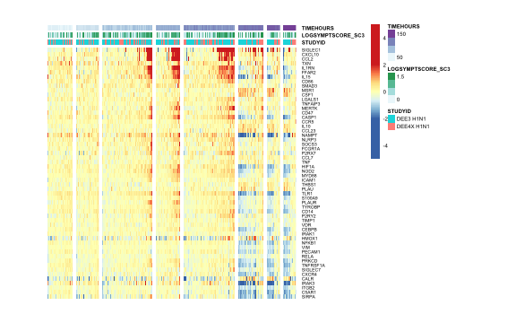

Load packages

```r
suppressPackageStartupMessages(library(package = "knitr"))
suppressPackageStartupMessages(library(package = "httr"))
suppressPackageStartupMessages(library(package = "Biobase"))
suppressPackageStartupMessages(library(package = "limma"))
suppressPackageStartupMessages(library(package = "pheatmap"))
suppressPackageStartupMessages(library(package = "biomaRt"))
suppressPackageStartupMessages(library(package = "tidyverse"))
```

Set default options/variables

```r
workDir <- dirname(getwd())
opts_chunk$set(tidy = FALSE, fig.path = "../figure/")
options(stringsAsFactors  = FALSE,
	readr.num_columns = 0)
# result will be written in directory called advanced
gseaDir <- file.path(workDir, "advanced")
if (!file.exists(gseaDir)) {
  flag <- dir.create(path = gseaDir)
}
```

Load DREAM RV challenge ExpressionSet

```r
esetURL <- file.path("https://github.com/sekalylab/dream/blob/master/output",
		     "dream.eset.RData?raw=true")
response <- GET(url = esetURL)
load(rawConnection(response$content))
```

Filter on H1N1 challenge participants w/o early treatment and with disease
severity measure

```r
eset <- eset[, grepl(pattern = "H1N1", eset$STUDYID) &
               (is.na(eset$EARLYTX) | eset$EARLYTX %in% 0) &
             (!is.na(eset$SYMPTOMATIC_SC2) | !is.na(eset$LOGSYMPTSCORE_SC3))]
```

Substract pre-challenge expression

```r
# select pre-challenge timepoints
esetPre <- eset[, eset$TIMEHOURS <= 0]
# average pre-challenge timepoints for each participant
preMat <- by(t(exprs(esetPre)),
	     INDICES = esetPre$SUBJECTID,
	     FUN     = colMeans) %>%
    do.call(what = cbind)
esetBaselined <- eset[, eset$TIMEHOURS > 0]
exprs(esetBaselined) <- exprs(esetBaselined) -
  preMat[, esetBaselined$SUBJECTID]
```

Identify genes correlated to disease severity score for each timepoint 
post-challenge

```r
# select timepoint with an effective of at least 10 participants
timeLS <- pData(esetBaselined) %>%
    group_by(TIMEHOURS) %>%
    summarize(n = n()) %>%
    filter(n >= 10)
print(timeLS)
```

```
## # A tibble: 18 x 2
##    TIMEHOURS     n
##        <dbl> <int>
##  1       5      36
##  2      12      34
##  3      21.5    32
##  4      29      31
##  5      36      36
##  6      45.5    35
##  7      53      34
##  8      60      34
##  9      69.5    33
## 10      77      35
## 11      84      36
## 12      93.5    36
## 13     101      36
## 14     108      34
## 15     118.     35
## 16     125      35
## 17     142.     31
## 18     166.     34
```

```r
esetTemp <- esetBaselined[, esetBaselined$TIMEHOURS %in% timeLS$TIMEHOURS]

goi <- paste0("SYMPT_", esetTemp$SYMPTOMATIC_SC2,
	      ".TIME", esetTemp$TIMEHOURS) %>%
    as.factor()
study <- factor(make.names(esetTemp$STUDYID))

designMat <- model.matrix(~0 + goi + study)
colnames(designMat) <- gsub(pattern     = "goi",
			    replacement = "",
			    colnames(designMat))
rownames(designMat) <- sampleNames(esetTemp)

fit <- lmFit(esetTemp, design = designMat)
contrastLS <- data.frame(V1 = grep(pattern = "^SYMPT_1",
				   colnames(fit),
				   value = TRUE)) %>%
  mutate(V2 = gsub(pattern = "_1", replacement = "_0", V1),
         contrast = paste0(V1, "-", V2)) %>%
  .$contrast
contrastMat <- makeContrasts(contrasts = contrastLS, levels = fit$design)
fit2 <- contrasts.fit(fit = fit, contrasts = contrastMat)
fit2 <- eBayes(fit = fit2)
```

Perform GSEA and test for enrichment of cell subsets markers (Nakaya et al.) 

```r
# download GSEA JAR application from the BROAD web site
gseaJar<- file.path(workDir, "utils/gsea-3.0.jar")
# downaload hallmark in GMT file from the MSigDB web site
gmtFile <-
  file.path(workDir,
	    "utils",
	    "NakayaHI_2011_NatImmunol.SupplementaryTable4.PBMC_subsets.gmt")
# create gene ranked by LIMMA t statistic
modelName <- "H1N1_SYMPT"
rnkList <- lapply(colnames(fit2$contrast), FUN = function(coefName) {
    top <- topTable(fit = fit2, coef = coefName, number = Inf) %>%
      as.data.frame() %>%
      select(Gene.Symbol, t)
    rnkFile <- paste0("gsea_", coefName, ".rnk") %>%
      make.names(.) %>%
      file.path(gseaDir, .)
    write(paste(c("#", colnames(top)), collapse = " "), file = rnkFile)
    write_tsv(top, path = rnkFile, append = TRUE)
    return(value = c(modelName   = modelName,
		     coefficient = coefName, 
                     rnk         = rnkFile))
})
rnkList <- do.call(what = rbind, args = rnkList) %>%
  as.data.frame()

# create GSEA parameters file
gseaParam <- file.path(gseaDir, "GSEAPrerankedParameters.txt")
gseaParamMat <- as.matrix(c(nperm                = "1000",                    
                            scoring_scheme       = "weighted",                
                            make_sets            = "true",                    
                            plot_top_x           = 1,                         
                            rnd_seed             = 101,                       
                            set_max              = 3000,                      
                            set_min              = 15,                        
                            zip_report           = "false",                   
                            gui                  = "false"),                  
                          ncol = 1) %>%                                       
  as.data.frame() %>%                                                         
  rownames_to_column()                                                        
write_tsv(gseaParamMat, path = gseaParam, col_names = FALSE)                  

# generate GSEA command line call
gseaJava <- "java -Xmx4G -cp"
gseaIndex <- lapply(rnkList[, "rnk"], FUN = function(gseaRnk) {
  # print(gseaRnk)
  logFileName <- gsub(pattern = "rnk$", replacement = "log", gseaRnk)
  gseaRpt <- paste(gsub(pattern     = "rnk",
                        replacement = "",
                        basename(gseaRnk)),
                   gsub(pattern     = "^([^\\.]+).+$",
                        replacement = "\\1",
                        basename(gmtFile)),
                     sep = ".")
  gseaCall <- paste(gseaJava,
                    gseaJar,
                    "xtools.gsea.GseaPreranked -param_file",
                    gseaParam,
                    "-rnk",
                    gseaRnk,
                    "-gmx",
                    gmtFile,
                    "-rpt_label",
                    gseaRpt,
                    "-out",
                    gseaDir,
                    ">",
                    logFileName)
  gseaIntern <- system(command       = gseaCall,
                       intern        = TRUE,
                       ignore.stderr = TRUE)
  return(value = c(rnk = gseaRnk, rpt = file.path(gseaDir, gseaRpt)))
})
gseaIndex <- do.call(what = rbind, args = gseaIndex)
gseaIndex <- merge(rnkList, gseaIndex, by = "rnk")

# remove previous gsea run from the advanced directory
dirLS <- list.dirs(gseaDir,
		   recursive = FALSE,
		   full.names = TRUE)
dirLS <- cbind(directory = dirLS,
               rpt       = gsub(pattern     = ".GseaPreranked.+$",
				replacement = "",
				dirLS))
gseaIndex <- merge(gseaIndex, dirLS, by = "rpt")

# read gsea output directories
gseaOutput <- apply(gseaIndex, MARGIN = 1, FUN = function(gseaRun) {
  gseaDir <- gseaRun[["directory"]]
  # read rpt file in gsea output directory
  rptFile <- list.files(path = gseaDir, pattern = "rpt", full.names = TRUE)
  rpt <- read_tsv(file      = rptFile,
                 col_names = c("type", "name", "value"))
  # read gmt file
  gmxFile <- rpt$value[rpt$name %in% "gmx"]
  cNames <- count_fields(file = gmxFile, tokenizer = tokenizer_tsv()) %>%
    max() %>%
    seq(from = 1) %>%
    as.character()
  gmx <- read_tsv(file = gmxFile, col_names = cNames)
  # remove geneset name and description column
  gsNames <- toupper(gmx$"1")
  gmx <- apply(select(gmx, -(1:2)), MARGIN = 1, FUN = function(x) {
    return(value = setdiff(unname(x), NA))
  })
  names(gmx) <- gsNames
  # read result files
  resFile <- grep(pattern = "gsea_report.*xls",
                  dir(path = gseaDir, full.names = TRUE),
                  value   = TRUE)
  resOut <- lapply(resFile, FUN = function(fileName) {
    resTable <- read_tsv(file = fileName)
  })
  resOut <- do.call(what = rbind, args = resOut)
  # extract leading edge genes
  rnk <- read_tsv(file      = gseaRun[["rnk"]],
                  skip      = 1,
                  col_names = c("SYMBOL", "t")) %>%
         arrange(desc(t))
  leGenes <- group_by(resOut, NAME) %>%
             do(LEADING_EDGE = ifelse(test = sign(.$NES) %in% 1,
                    yes = paste(intersect(rnk$SYMBOL[seq(from = 1,
                        to = .$"RANK AT MAX" + 1)],
                        gmx[[.$NAME]]), collapse = ","),
                    no  = paste(intersect(rnk$SYMBOL[seq(from = nrow(rnk) -
                        .$"RANK AT MAX",
                        to = nrow(rnk))],
                        gmx[[.$NAME]]), collapse = ","))) %>%
             ungroup() %>%
             mutate(LEADING_EDGE = unlist(LEADING_EDGE))
  resOut <- merge(resOut, leGenes, by = "NAME")
  # append directory name
  resOut <- mutate(resOut, directory = gseaDir)
  return(value = resOut)
})
gseaOutput <- do.call(what = rbind, args = gseaOutput)
gseaOutput <- merge(gseaOutput, gseaIndex, by = "directory")
save(gseaOutput, file = file.path(workDir,
				  "output/dream.gseaOutput.nakaya.RData"))
```


Delete temporary and advanced directories create during gsea run

```r
dirName <- tolower(format(Sys.Date(), "%b%d"))
file.remove(dirName)
# remove advanced directory                                                   
unlink(gseaDir, recursive = TRUE)
```

Print statistically significant enriched genesets for the 15h timepoint

```r
sigDF <- filter(gseaOutput, NES > 0 & `NOM p-val` <= 0.05) %>%
  select(NAME, NES, `NOM p-val`, `FDR q-val`, modelName, coefficient, LEADING_EDGE)
filter(sigDF, !grepl(pattern = "-", NAME) | NAME %in% c("T-CELLS", "B-CELLS")) %>%
  select(-LEADING_EDGE)
```

```
##        NAME      NES   NOM p-val   FDR q-val  modelName
## 1 MONOCYTES 1.347872 0.000000000 0.053561892 H1N1_SYMPT
## 2 MONOCYTES 1.513681 0.000000000 0.028698910 H1N1_SYMPT
## 3 MONOCYTES 1.605729 0.000000000 0.018228630 H1N1_SYMPT
## 4 MONOCYTES 1.619323 0.000000000 0.030558405 H1N1_SYMPT
## 5       MDC 1.259353 0.038961038 0.137424290 H1N1_SYMPT
## 6 MONOCYTES 2.113140 0.000000000 0.000000000 H1N1_SYMPT
## 7 MONOCYTES 1.674766 0.000000000 0.008899525 H1N1_SYMPT
## 8       MDC 1.393792 0.005830904 0.039177347 H1N1_SYMPT
## 9 MONOCYTES 1.882989 0.000000000 0.002666667 H1N1_SYMPT
##                         coefficient
## 1   SYMPT_1.TIME101-SYMPT_0.TIME101
## 2     SYMPT_1.TIME36-SYMPT_0.TIME36
## 3     SYMPT_1.TIME60-SYMPT_0.TIME60
## 4 SYMPT_1.TIME69.5-SYMPT_0.TIME69.5
## 5     SYMPT_1.TIME77-SYMPT_0.TIME77
## 6     SYMPT_1.TIME77-SYMPT_0.TIME77
## 7     SYMPT_1.TIME84-SYMPT_0.TIME84
## 8 SYMPT_1.TIME93.5-SYMPT_0.TIME93.5
## 9 SYMPT_1.TIME93.5-SYMPT_0.TIME93.5
```
Monocytes are the subsets the most strongly associated with severity of symptoms in blood.  
  
Plot heatmap of monocytes markers and their association with severity of symptoms

```r
leLS <- filter(sigDF, NAME %in% "MONOCYTES") %>%
  .$LEADING_EDGE %>%
  strsplit(",") %>%
  unlist() %>%
  unique()
# filter on genes also associated with H5 in mice datasets
load(file = file.path(workDir, "output/fluomics.gseaOutput.RData"))
mouseMo <- filter(gseaOutput, NAME %in% "MONOCYTES" & `FDR q-val` <= 0.05) %>%
  .$LEADING_EDGE %>%
  strsplit(split = ",") %>%
  unlist() %>%
  unique()
leLS <- intersect(leLS, mouseMo)
# filter on genes known to have a function in monocytes (using generif)
generifPath <- file.path(workDir, "utils/generifs_basic")
generif <- scan(file = generifPath, what = "raw", sep = "\n")
generif <- generif %>%
  strsplit(split = "\t") %>%
  do.call(what = rbind)
header <- generif[1, ] %>%
  gsub(pattern = "#", replacement = "")
generif <- generif[-1, ] %>%
  as.data.frame() %>%
  setNames(header)
human <- useMart("ensembl", dataset = "hsapiens_gene_ensembl")
humanGeneIds <- getBM(mart       = human,
                      attributes = c("entrezgene_id", "hgnc_symbol"),
                      filters    = "hgnc_symbol",
                      values     = leLS)
generifTemp <- data.frame(symbol = leLS) %>%
  merge(y     = humanGeneIds,
        by.x  = "symbol",
        by.y  = "hgnc_symbol",
        all.x = TRUE) %>%
  merge(y     = generif,
        by.x  = "entrezgene_id",
        by.y = "Gene ID",
        all.x = TRUE) %>%
  filter(grepl(pattern = "monocyt", `GeneRIF text`, ignore.case = TRUE))
# keep genes with three or more reference
generifTemp <- generifTemp %>%
  group_by(symbol) %>%
  summarize(n.pmid = length(unique(`PubMed ID (PMID) list`))) %>%
  filter(n.pmid >= 3)

mat <- exprs(esetBaselined)[match(generifTemp$symbol, fData(esetBaselined)$"Gene Symbol"), ]
cAnnotDF <- pData(esetBaselined)[, c("STUDYID",
                                     "LOGSYMPTSCORE_SC3",
                                     "TIMEHOURS")]
colOrder <- data.frame(mu = colMeans(mat)) %>%
  rownames_to_column() %>%
  merge(y = rownames_to_column(cAnnotDF), by = "rowname") %>%
  mutate(TIMEHOURS = round(TIMEHOURS/24)) %>%
  arrange(TIMEHOURS, mu, LOGSYMPTSCORE_SC3)
breakLS <- c(-5, seq(from = -2, to = 2, length.out = 99), 5) 
pheatmap(mat            = mat[order(rowMeans(mat), decreasing = TRUE),
			      colOrder$rowname],
         breaks         = breakLS,
	 show_colnames  = FALSE,
	 treeheight_row = 0,
         labels_row     = generifTemp$symbol[order(rowMeans(mat), decreasing = TRUE)],
         cellwidth      = 0.4,
         cellheight     = 5,
         annotation_col = cAnnotDF,
         cluster_cols   = FALSE,
	 cluster_rows   = FALSE,
         gaps_col       = cumsum(table(colOrder$TIMEHOURS)),
	 fontsize_row   = 5,
	 fontsize       = 6)
```



```r
# print association of monocytes and severity
colOrder %>%
  group_by(TIMEHOURS) %>%
  do(rho = cor.test(formula = ~mu+LOGSYMPTSCORE_SC3, data = .,
		     method = "spearman")$estimate,
     p = cor.test(formula = ~mu+LOGSYMPTSCORE_SC3, data = .,
		   method = "spearman")$p.value) %>%
  ungroup() %>%
  mutate(rho = unlist(rho),
	 p = unlist(p)) %>%
  filter(p <= 0.05)
```

```
## # A tibble: 3 x 3
##   TIMEHOURS   rho        p
##       <dbl> <dbl>    <dbl>
## 1         2 0.286 6.41e- 4
## 2         3 0.549 1.26e- 6
## 3         4 0.491 5.42e-10
```

Print session info

```r
sessionInfo()
```

```
## R version 3.6.0 (2019-04-26)
## Platform: x86_64-apple-darwin18.5.0 (64-bit)
## Running under: macOS Mojave 10.14.5
## 
## Matrix products: default
## BLAS/LAPACK: /usr/local/Cellar/openblas/0.3.6_1/lib/libopenblasp-r0.3.6.dylib
## 
## locale:
## [1] en_US.UTF-8/en_US.UTF-8/en_US.UTF-8/C/en_US.UTF-8/en_US.UTF-8
## 
## attached base packages:
## [1] parallel  stats     graphics  grDevices utils     datasets  methods  
## [8] base     
## 
## other attached packages:
##  [1] forcats_0.4.0       stringr_1.4.0       dplyr_0.8.1        
##  [4] purrr_0.3.2         readr_1.3.1         tidyr_0.8.3        
##  [7] tibble_2.1.3        ggplot2_3.2.0       tidyverse_1.2.1    
## [10] biomaRt_2.40.0      pheatmap_1.0.12     limma_3.40.2       
## [13] Biobase_2.44.0      BiocGenerics_0.30.0 httr_1.4.0         
## [16] knitr_1.23         
## 
## loaded via a namespace (and not attached):
##  [1] Rcpp_1.0.1           lubridate_1.7.4      lattice_0.20-38     
##  [4] prettyunits_1.0.2    zeallot_0.1.0        utf8_1.1.4          
##  [7] assertthat_0.2.1     digest_0.6.19        R6_2.4.0            
## [10] cellranger_1.1.0     backports_1.1.4      stats4_3.6.0        
## [13] RSQLite_2.1.1        evaluate_0.14        highr_0.8           
## [16] pillar_1.4.1         rlang_0.4.0          progress_1.2.2      
## [19] curl_3.3             lazyeval_0.2.2       readxl_1.3.1        
## [22] rstudioapi_0.10      blob_1.1.1           S4Vectors_0.22.0    
## [25] RCurl_1.95-4.12      bit_1.1-14           munsell_0.5.0       
## [28] broom_0.5.2          compiler_3.6.0       modelr_0.1.4        
## [31] xfun_0.8             pkgconfig_2.0.2      tidyselect_0.2.5    
## [34] IRanges_2.18.1       XML_3.98-1.20        fansi_0.4.0         
## [37] withr_2.1.2          crayon_1.3.4         bitops_1.0-6        
## [40] grid_3.6.0           nlme_3.1-140         jsonlite_1.6        
## [43] gtable_0.3.0         DBI_1.0.0            magrittr_1.5        
## [46] scales_1.0.0         cli_1.1.0            stringi_1.4.3       
## [49] xml2_1.2.0           vctrs_0.1.0          generics_0.0.2      
## [52] RColorBrewer_1.1-2   tools_3.6.0          bit64_0.9-7         
## [55] glue_1.3.1           hms_0.4.2            AnnotationDbi_1.46.0
## [58] colorspace_1.4-1     rvest_0.3.4          memoise_1.1.0       
## [61] haven_2.1.0
```
