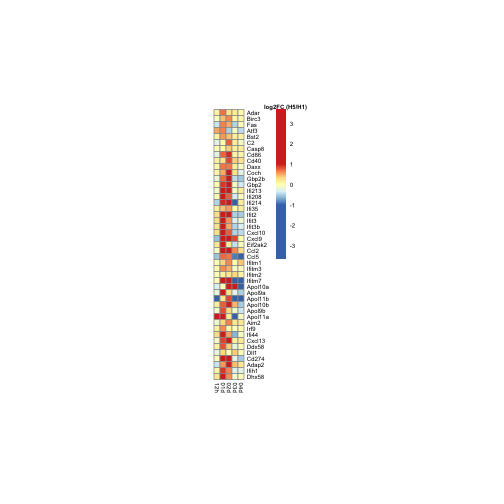

Load required packages

```r
suppressPackageStartupMessages(library(package = "knitr"))
suppressPackageStartupMessages(library(package = "biomaRt"))
suppressPackageStartupMessages(library(package = "edgeR"))
suppressPackageStartupMessages(library(package = "pheatmap"))
suppressPackageStartupMessages(library(package = "gtable"))
suppressPackageStartupMessages(library(package = "grid"))
suppressPackageStartupMessages(library(package = "tidyverse"))
```

Set session options

```r
workDir <- dirname(getwd())
opts_chunk$set(tidy = FALSE, fig.path = "../figure/")
options(readr.num_columns = 0,
        stringsAsFactors  = FALSE)
```

Load GSEA output

```r
load(file = file.path(workDir, "output/fluomics.gseaOutput.RData"))
```

Load GLMLRT list

```r
load(file = file.path(workDir, "output/fluomics.fits.RData"))
```

Print interferon-related genesets enriched in H5N1 vs H1N1 at Day 2

```r
gseaOutput %>%
  filter(grepl(pattern = "INTERFEROME", NAME) & `FDR q-val` <= 0.05) %>%
  select(NAME, NES, `FDR q-val`, coefName)
```

```
##                       NAME       NES   FDR q-val          coefName
## 1  INTERFEROME_IFNALPHA_UP  2.676842 0.000000000 H5N1.01d-H1N1.01d
## 2   INTERFEROME_IFNBETA_UP  2.502325 0.000000000 H5N1.01d-H1N1.01d
## 3  INTERFEROME_IFNGAMMA_UP  2.369302 0.000000000 H5N1.01d-H1N1.01d
## 4  INTERFEROME_IFNALPHA_UP  2.251565 0.000000000 H5N1.02d-H1N1.02d
## 5   INTERFEROME_IFNBETA_UP  2.289394 0.000000000 H5N1.02d-H1N1.02d
## 6  INTERFEROME_IFNGAMMA_UP  1.972056 0.000000000 H5N1.02d-H1N1.02d
## 7  INTERFEROME_IFNALPHA_DN -1.821462 0.000000000 H5N1.12h-H1N1.12h
## 8   INTERFEROME_IFNBETA_DN -1.600455 0.000000000 H5N1.12h-H1N1.12h
## 9   INTERFEROME_IFNBETA_UP -1.374190 0.014560005 H5N1.12h-H1N1.12h
## 10 INTERFEROME_IFNGAMMA_DN -1.502291 0.001066667 H5N1.12h-H1N1.12h
## 11 INTERFEROME_IFNGAMMA_UP -1.474868 0.002300000 H5N1.12h-H1N1.12h
```

Convert mouse genes to human genes

```r
humanGenes <- gseaOutput$LEADING_EDGE %>%
  strsplit(",") %>%
  unlist() %>%
  unique()
human <- useMart("ensembl", dataset = "hsapiens_gene_ensembl")
mouse <- useMart("ensembl", dataset = "mmusculus_gene_ensembl")
human2mouse <- getLDS(attributes  = c("hgnc_symbol", "entrezgene"),
		      filters     = "hgnc_symbol",
		      values      = humanGenes,
		      mart        = human,
		      attributesL = c("ensembl_gene_id", "mgi_symbol"),
		      martL       = mouse,
		      uniqueRows  = TRUE)
```

Identify leading edge genes

```r
leGenes <- gseaOutput %>%
  filter(NAME %in% "INTERFEROME_IFNBETA_UP" & `FDR q-val` <= 0.05 & NES > 0)
leGenes$LEADING_EDGE %>%
  strsplit(split = ",") %>%
  setNames(nm = leGenes$NAME) %>%
  stack() %>%
  filter(!duplicated(values)) -> leGenes
leGenes <- merge(x    = leGenes,
		 y    = human2mouse,
		 by.x = "values",
		 by.y = "HGNC.symbol") %>%
  arrange(MGI.symbol) %>%
  filter(!duplicated(Gene.stable.ID) & !is.na(MGI.symbol))
							  
# filter on genes known to have a function in monocytes (using generif)
generifPath <- file.path(workDir, "utils/generifs_basic")
generif <- scan(file = generifPath, what = "raw", sep = "\n")
generif <- generif %>%
  strsplit(split = "\t") %>%
  do.call(what = rbind)
header <- generif[1, ] %>%
  gsub(pattern = "#", replacement = "")

generif <- generif[-1, ] %>%
  as.data.frame() %>%
  setNames(header)

leGenes <- leGenes %>%
  merge(y     = generif,
	by.x  = "NCBI.gene.ID",
	by.y = "Gene ID",
	all.x = TRUE) %>%
  filter(grepl(pattern = "interferon", `GeneRIF text`, ignore.case = TRUE)) %>%
  filter(!duplicated(MGI.symbol))
```

Plot heatmap with leading edge genes

```r
# extract DGEGLM comparing H5N1 to H1N1
fit <- fits[["virus"]][["fit"]]

fcDF <- lapply(colnames(fit$contrast), FUN = function(contrastName) {
  top  <- glmLRT(fit, contrast = fit$contrast[, contrastName]) %>%
    topTags(n = Inf) %>%
    as.data.frame() %>%
    rownames_to_column() %>%
    filter(rowname %in% leGenes$Gene.stable.ID) %>%
    mutate(coefName = contrastName) %>%
    select(rowname, logFC, coefName)
  return(value = top)
}) %>%
  do.call(what = rbind) %>%
  mutate(coefName = gsub(pattern = ".+\\.([^\\.]+)$",
			 replacement = "\\1",
			 coefName),
	 coefName = factor(coefName),
	 coefName = relevel(coefName, ref = "12h")) %>%
  spread(coefName, logFC) %>%
  column_to_rownames(var = "rowname")

breakLS <- c(-1 * max(abs(fcDF)),
	     seq(from = -1, to = 1, length.out = 99),
	     max(abs(fcDF)))
pheat <- pheatmap(mat = fcDF[leGenes$Gene.stable.ID, ],
		  breaks = breakLS,
		  cluster_cols = FALSE,
		  cluster_rows = FALSE,
		  cellwidth = 6,
		  cellheight = 6,
		  fontsize = 6,
		  labels_row = leGenes$MGI.symbol,
		  silent = TRUE)
colorName <- textGrob(label = "log2FC (H5/H1)",
		      x     = 0.5,
		      y     = 1.01,
		      gp    = gpar(fontface = "bold"))

pheat$gtable <- gtable_add_grob(pheat$gtable,
				colorName,
				t    = 4,
				l    = 5,
				b    = 5,
				clip = "off",
				name = "colorName")
grid.draw(pheat$gtable)
```



Print session info

```r
sessionInfo()
```

```
## R version 3.5.3 (2019-03-11)
## Platform: x86_64-apple-darwin18.2.0 (64-bit)
## Running under: macOS Mojave 10.14.4
## 
## Matrix products: default
## BLAS/LAPACK: /usr/local/Cellar/openblas/0.3.5/lib/libopenblasp-r0.3.5.dylib
## 
## locale:
## [1] en_US.UTF-8/en_US.UTF-8/en_US.UTF-8/C/en_US.UTF-8/en_US.UTF-8
## 
## attached base packages:
## [1] grid      stats     graphics  grDevices utils     datasets  methods  
## [8] base     
## 
## other attached packages:
##  [1] forcats_0.4.0   stringr_1.4.0   dplyr_0.8.0.1   purrr_0.3.2    
##  [5] readr_1.3.1     tidyr_0.8.3     tibble_2.1.1    ggplot2_3.1.1  
##  [9] tidyverse_1.2.1 gtable_0.3.0    pheatmap_1.0.12 edgeR_3.24.3   
## [13] limma_3.38.3    biomaRt_2.38.0  knitr_1.22     
## 
## loaded via a namespace (and not attached):
##  [1] Rcpp_1.0.1           locfit_1.5-9.1       lubridate_1.7.4     
##  [4] lattice_0.20-38      prettyunits_1.0.2    assertthat_0.2.1    
##  [7] digest_0.6.18        R6_2.4.0             cellranger_1.1.0    
## [10] plyr_1.8.4           backports_1.1.4      stats4_3.5.3        
## [13] RSQLite_2.1.1        evaluate_0.13        highr_0.8           
## [16] httr_1.4.0           pillar_1.3.1         rlang_0.3.4         
## [19] progress_1.2.0       curl_3.3             lazyeval_0.2.2      
## [22] readxl_1.3.1         rstudioapi_0.10      blob_1.1.1          
## [25] S4Vectors_0.20.1     RCurl_1.95-4.12      bit_1.1-14          
## [28] munsell_0.5.0        broom_0.5.2          compiler_3.5.3      
## [31] modelr_0.1.4         xfun_0.6             pkgconfig_2.0.2     
## [34] BiocGenerics_0.28.0  tidyselect_0.2.5     IRanges_2.16.0      
## [37] XML_3.98-1.19        withr_2.1.2          crayon_1.3.4        
## [40] bitops_1.0-6         nlme_3.1-139         jsonlite_1.6        
## [43] DBI_1.0.0            magrittr_1.5         scales_1.0.0        
## [46] cli_1.1.0            stringi_1.4.3        xml2_1.2.0          
## [49] generics_0.0.2       RColorBrewer_1.1-2   tools_3.5.3         
## [52] bit64_0.9-7          Biobase_2.42.0       glue_1.3.1          
## [55] hms_0.4.2            parallel_3.5.3       AnnotationDbi_1.44.0
## [58] colorspace_1.4-1     rvest_0.3.3          memoise_1.1.0       
## [61] haven_2.1.0
```
